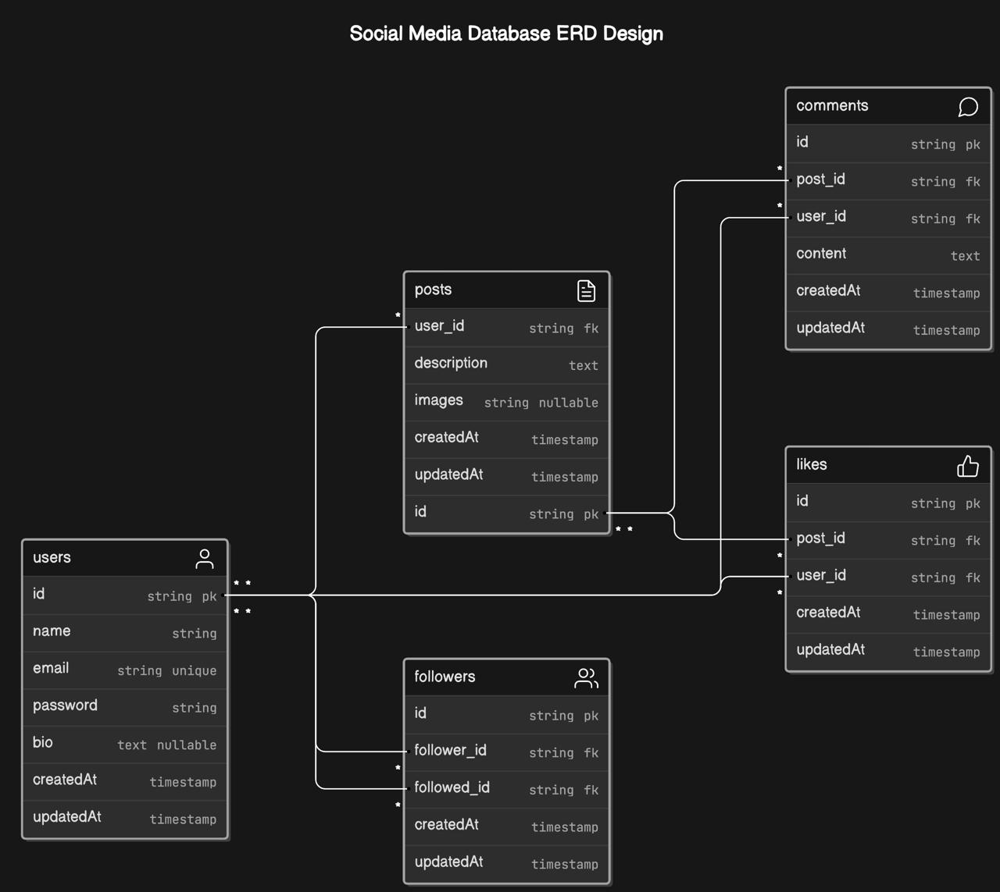

<h1 align="center">Social Media API</h1>

## Description
This is a brief guide to setting up a Laravel project using PostgreSQL or MySql and migration after cloning the repository.


### Installation Guide

1. **Clone the repository:**

    ```bash
    git clone https://github.com/mhdusop/social-media-API
    ```

2. **Navigate to the project directory:**

    ```bash
    cd social-media-API
    ```

3. **Install PHP dependencies using Composer:**

    ```bash
    composer install
    ```

4. **Copy the `.env.example` file to `.env`:**

    ```bash
    cp .env.example .env
    ```

5. **Configure your `.env` file with your PostgreSQL credentials:**

    ```dotenv
    DB_CONNECTION=pgsql
    DB_HOST=127.0.0.1
    DB_PORT=5432
    DB_DATABASE=your_database_name
    DB_USERNAME=your_database_username
    DB_PASSWORD=your_database_password
    ```
6. **If use MySql**
    ```dotenv
    DB_CONNECTION=mysql
    DB_HOST=127.0.0.1
    DB_PORT=3306
    DB_DATABASE=your_database_name
    DB_USERNAME=your_database_name
    DB_PASSWORD=your_database_name
    ```
7. **Generate a new application key:**

    ```bash
    php artisan key:generate
    ```

8. **Run the database migrations:**

    ```bash
    php artisan migrate
    ```

9. **Run the server:**

    ```bash
    php artisan serve
    ```
    
### ERD Social Media  


